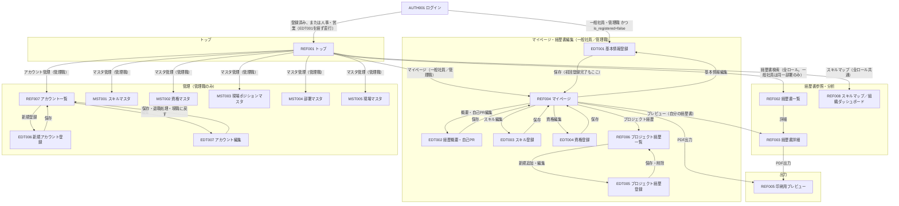

# 画面遷移図

Mermaid記法。GitHub/VS Code/Claude Codeでそのまま図としてレンダリングされる。

<!--
この図の読み方・方針:
- 主要な業務遷移のみを描く。パンくずリストによる上位階層への移動
  （全画面共通、AUTH001を除く）と「戻る」は矢印を省略している
- エッジのラベルはボタン・条件を表す。ロール制限があるものはラベルに記載
- CMN001（削除確認モーダル）は画面遷移を伴わないため図に含めない
  （呼び出し元: EDT005・EDT007・MST001〜005。詳細はscreens.md参照）
- Excelダウンロードは画面遷移なし（直接ダウンロード）のため図に含めない
- 本図はscreens.md・schema.mdの確定仕様（2026-07）から生成した
-->

## 補足

- **人事・営業の初回ログイン**: 経歴書を作成しないため、EDT001（初回登録）を経ずREF001へ直行する。ログイン成立時に`is_registered`を自動でTRUEに更新（AUTH001参照）
- **ログインのエラー分岐**（未登録／退職済み／プロバイダ不一致）は遷移を伴わない（AUTH001に留まる）ため図から省略。文言はscreens.mdのAUTH001参照
- **EDT007の退職処理・現職に戻す**は`employment_status`による排他表示。どちらもCMN001で確認後、REF007へ戻る
- **Excelダウンロード**はREF003・REF004から直接ダウンロード（画面遷移なし）
